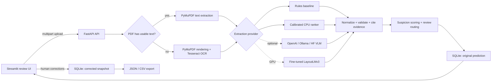
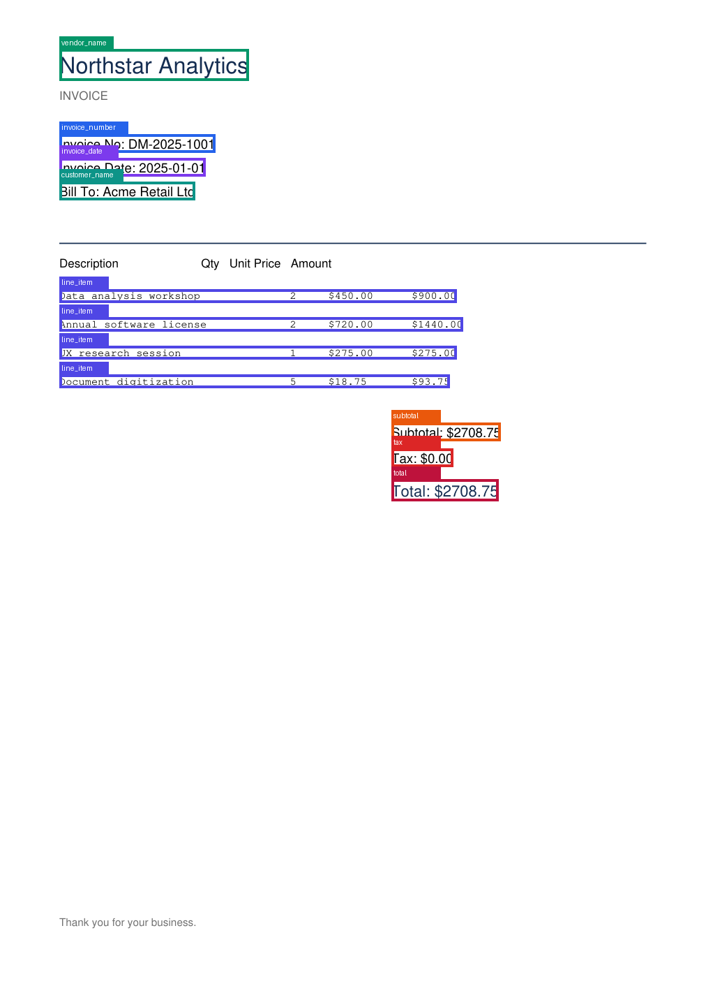

# DocuMind — Multimodal Invoice Intelligence

DocuMind is a local-first invoice review application that turns PDF or image invoices into validated,
editable structured data. It demonstrates a practical ML system loop rather than a parsing demo:
document routing, OCR, deterministic extraction, confidence-aware review, audit-friendly persistence,
evaluation, and export.

The project exposes six comparable extraction modes: rules, a trained CPU ranker, a paid OpenAI
multimodal API, Ollama vision, a pretrained Hugging Face VLM, and fine-tuned LayoutLMv3. Rules and the
committed learned ranker work without a paid key; heavyweight providers are optional.

## What works

- Upload PDF, PNG, JPEG; reject unsupported types and oversized files.
- Detect usable PDF text and fall back to Tesseract OCR for image-only pages.
- Extract invoice number/date, vendor/customer, currency, line items, subtotal, tax, and total.
- Normalize ISO dates, currency codes, and locale-aware numeric strings.
- Validate `subtotal + tax ≈ total` and line-item sum versus subtotal.
- Attach transparent heuristic confidence scores and flag low-confidence fields in the UI.
- Train and serve a calibrated spatial/text candidate-ranking model on CPU.
- Cite every supported extraction with page number, bounding box, and highlighted source region.
- Detect arithmetic, date, tax, duplicate, missing-field, and confidence anomalies.
- Route suspicious or uncertain documents to human review.
- Measure field/table/document accuracy, anomaly precision/recall, latency, tokens, and cost.
- Review the original beside editable fields and line items.
- Preserve both original prediction and corrected snapshot in SQLite.
- Export the active reviewed result as JSON or flattened CSV.
- Evaluate rules and optional model providers against deterministic labeled invoices.

## Architecture



The code intentionally stays monolithic and readable: the API, UI, worker-free extraction path, and
SQLite database run on one machine. Provider abstraction exists only at the extraction boundary.

## Repository structure

```text
documind/                 FastAPI app, schemas, persistence, extraction pipeline
  api/routes.py           upload, correction, file, and export endpoints
  extraction/             document routing, normalization, rules, providers, validation
frontend/app.py           Streamlit review interface
scripts/generate_invoices.py
evaluation/evaluate.py    metrics table and concrete mismatch capture
models/                   committed CPU ranker; optional checkpoints ignored
  model_card.md           training data, metrics, intended use, and limitations
training/                 generated training corpus location
docs/providers.md         setup for all six execution modes
docs/ml_methodology.md    features, training, evidence, and routing design
evaluation/results.md     measured, scoped results
evaluation/failure_examples.md
samples/                  two text PDFs, one image-only PDF, and ground truth
tests/                    unit and API integration tests
.github/workflows/ci.yml
Dockerfile
docker-compose.yml
```

## Quick start with Docker

Requirements: Docker with Compose. No host Python or Tesseract installation is needed.

```bash
cp .env.example .env
docker compose up --build
```

Open Streamlit at <http://localhost:8501>. FastAPI docs are at
<http://localhost:8000/docs>; health is at <http://localhost:8000/health>.

Data is retained in the `documind-data` named volume. The API container runs as a non-root user.

## Local development

Requirements: Python 3.11 and Tesseract on `PATH` (`brew install tesseract` on macOS or
`apt-get install tesseract-ocr` on Debian/Ubuntu).

```bash
python3.11 -m venv .venv
source .venv/bin/activate
pip install -e ".[dev,model]"
cp .env.example .env
uvicorn documind.main:app --reload
```

In a second terminal:

```bash
source .venv/bin/activate
streamlit run frontend/app.py
```

The UI defaults to `http://localhost:8000`. Override with `DOCUMIND_API_URL` when needed.

## API examples

```bash
curl -F "file=@samples/invoice_001_text.pdf" \
  "http://localhost:8000/api/v1/documents?provider=rules"

curl -X PUT -H "Content-Type: application/json" \
  -d '{"customer_name":"Corrected Customer","total":2708.75}' \
  http://localhost:8000/api/v1/documents/DOCUMENT_ID/corrections

curl -OJ "http://localhost:8000/api/v1/documents/DOCUMENT_ID/export?format=json"
curl -OJ "http://localhost:8000/api/v1/documents/DOCUMENT_ID/export?format=csv"
```

## Extraction providers

Choose `rules`, `learned`, `openai`, `ollama`, `pretrained_vlm`, or `finetuned_layoutlm` in the UI.
The capability endpoint disables providers whose credential, model, or runtime is absent. Complete
setup and hardware guidance is in [`docs/providers.md`](docs/providers.md); the training design is in
[`docs/ml_methodology.md`](docs/ml_methodology.md).

## Evaluation

Train the CPU model, generate 30 evaluation invoices with three anomalies, and compare providers:

```bash
make train
python scripts/generate_invoices.py --count 30 --anomaly-every 10
python evaluation/evaluate.py --provider all
```

Compare both providers only when a paid key is intentionally available:

```bash
OPENAI_API_KEY=... python evaluation/evaluate.py --provider all
```

Metrics:

- **Exact match:** strict equality across the eight scalar target fields.
- **Normalized field accuracy:** case/whitespace normalization for text and two-decimal comparison for numbers.
- **Line-item accuracy:** positional item match across description, quantity, unit price, and amount.
- **Document accuracy:** all scalar fields correct and predicted line-item count correct.

The evaluator prints a Markdown table and writes up to ten concrete mismatches per provider to
`evaluation/generated/failure_examples.json`. It never substitutes or fabricates model results.

### Measured result

| Provider | Corpus | Exact match | Normalized fields | Line items | Documents |
|---|---|---:|---:|---:|---:|
| rules | 30 text-native synthetic PDFs | 100.0% | 100.0% | 100.0% | 100.0% |
| learned CPU ranker | separate train/eval seeds | 100.0% | 100.0% | 100.0% | 100.0% |
| heavy/API providers | not run — required runtime absent | — | — | — | — |

This result is an in-distribution pipeline sanity check, not a production accuracy claim. The local
verification host lacked Tesseract, so OCR accuracy is deliberately not reported. See
[`evaluation/results.md`](evaluation/results.md) for the command and scope and
[`evaluation/failure_examples.md`](evaluation/failure_examples.md) for executed rule failures.

## Tests and verified commands

The following commands were run successfully on 2026-06-29:

```bash
ruff check .
pytest --cov=documind --cov-report=term-missing
python scripts/generate_invoices.py --count 30 --scan-every 0
python evaluation/evaluate.py --provider rules
python scripts/train_ranker.py
python evaluation/evaluate.py --provider learned
```

Tests cover Streamlit rendering,
document routing,
normalization, arithmetic validation, confidence behavior, generator consistency, file rejection,
evidence coordinates/highlighting, learned inference, suspicion routing, and the complete API upload →
correction → original-preservation → export path.

Latest local result: **22 tests passed**, **81% package coverage**, and lint clean. Optional GPU/API
branches are capability-tested but excluded from coverage until their external runtimes are present.

CI installs Tesseract, runs lint/tests, trains the CPU ranker, generates a mixed corpus, and compares
rules with learned extraction on every pull request. Paid and heavyweight providers remain excluded
because they require credentials, model downloads, or GPU hardware.

## Screenshots

### Learned extraction evidence



Additional portfolio screenshots to capture after running Streamlit:

1. Upload and provider selection.
2. Side-by-side PDF and confidence-aware field review.
3. Failed arithmetic validation and corrected result.

The checked-in PDFs under `samples/` are safe synthetic fixtures suitable for screenshots.

## Confidence semantics

Rules confidence is a review-prioritization heuristic, while the learned provider uses calibrated
classifier probabilities. Neither should be interpreted as production-calibrated until evaluated on
representative real invoices. Human edits receive confidence `1.0` with source `corrected`, while the
original score remains available in the stored prediction.

## Limitations

- English, single-invoice documents only; no handwriting or multi-invoice splitting.
- Regex rules favor labeled fields and simple row layouts; wrapped/merged columns remain difficult.
- Numeric dates such as `03/04/2025` are locale-ambiguous.
- Tesseract quality depends on scan resolution, rotation, noise, and installed language packs.
- Currency is left unknown when neither an ISO code nor recognizable symbol is present.
- SQLite and local file storage suit a portfolio/demo deployment, not multi-tenant production.
- Upload validation uses type/extension checks; production should add malware scanning and stronger
  content sniffing.
- Rules confidence has not been calibrated against human correctness labels.
- The CPU ranker is calibrated on synthetic layouts; real-vendor calibration data is still required.
- GPU/VLM adapters are functional but intentionally have no claimed metrics until executed.

## Future improvements

- Calibrate and fine-tune with a held-out, anonymized real invoice set.
- Add table reconstruction using word coordinates for wrapped and multi-line items.
- Expand the labeled corpus with anonymized real layouts, rotations, blur, and locale variants.
- Add vendor-template hints learned from accepted human corrections.
- Encrypt stored documents, add retention controls, authentication, and audit events.
- Add PEFT/LoRA fine-tuning for the pretrained VLM path.

## Responsible use

Synthetic samples contain no real customer data. For real invoices, treat uploads and extracted data
as sensitive financial information, restrict access, define retention, and review model-provider data
handling before enabling external calls.
